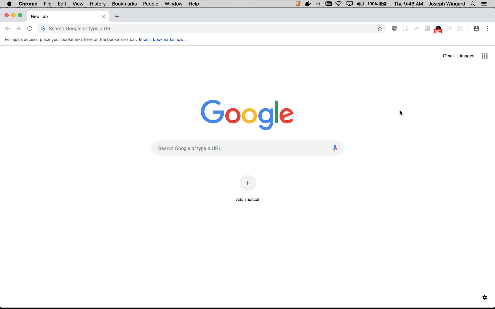
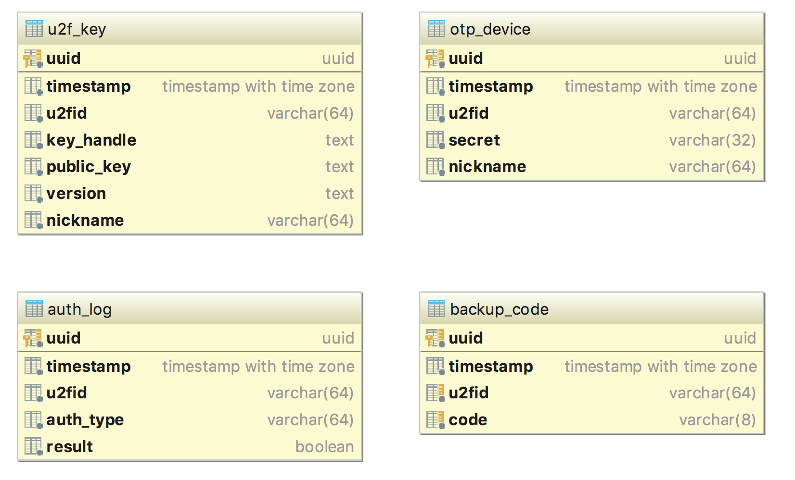

# Universal 2nd Factor Microservice

## Getting Started

These instructions will help you get the project up and running.

For more information about **Universal 2nd Factor** & **One-Time Password** see :
- [`yubikey: U2F Overview`](https://developers.yubico.com/U2F/)
- [`fido: Standards Overview`](https://fidoalliance.org/specifications/overview/)
- [`wiki: Universal 2nd Factor`](https://en.wikipedia.org/wiki/Universal_2nd_Factor)
- [`wiki: OTP (totp)`](https://en.wikipedia.org/wiki/Time-based_One-time_Password_algorithm)


## Prerequisites

The [`u2f js api`](https://developers.yubico.com/U2F/Libraries/Using_a_library.html) requires the web client be served via https . This requirement creates a hurdle for developers to get up and running. For development, this project uses an NGINX proxy with https enabled.

The webserver resolves to domain names, so you'll have to add the domain ([`example.com`](https://example.com) is the default) to your local system (`/etc/hosts` or appropriate file)

Add DNS Records

```
0.0.0.0      api.example.com docs.example.com coverage.example.com example.com
```

---

## Development

Development doesn't require local installion of node or any of the project's dependencies. Instead, those dependencies are bundled within the docker container and [`nodemon`](https://nodemon.io/) is leveraged to monitor changes to the app's source (from your local system which is mounted to the docker container) and reload the microservice.

This command starts the app, it's dependencies (database & cache), and additional development services (https proxy & more).
```
make run
```


## Quick Development Links

* [`API Endpoint`](https://api.example.com/) - API Service
* [`API Documentation`](https://docs.example.com/) - Swagger UI
* [`Test Coverage`](https://coverage.example.com/) - HTML Coverage Report
* [`Demo Client`](https://example.com/) - Basic Client for Demo & Development
* `chrome://inspect/#devices` - Node Inspector that consumes debugger listening on websockets
## HTTPS Security Note

Chrome won't trust the https certs served by the development NGINX proxy. As such, you'll need to manually **proceed** past the security warnings before you can interact with the API or any of the development services.



---

## Deployment

To run **production image**:

```
make start
```

This process starts the database (with persistent data), cache server and the api microservice (and none of the development dependencies)

* Database | no port exposed
* Cache Server | no port exposed
* [API Microservice](http://0.0.0.0:8443) | port 8443

##### NOTE: In **Production**, you'll want to make sure you're managing the db service correctly (backups, dumps, snapshots, redundancy, etc). 

To build and tag a **production image** (`u2f-server:master`) with your local changes use:

```
make release
```

---

## Running Tests

Unit Tests can be run inside the container or locally. Running the tests inside the container eliminates your need to install node_modules locally.


### Running inside the container

The command mounts your local `src` directory inside the container and runs the test suite.
```
make test
```

### Running inside the container

The command mounts your local `src` directory inside the container and runs the test suite.
```
# install node packages
npm i

# run test suite
npm run test

# run test suite AND generate HTML Coverage Report
npm run test:coverage
```

### Note about Code Coverage

This docker images (**`u2f-server:develop`** & **`u2f-server:master`**) both generate the code coverage HTML when the container starts (this is done in the entrypoint script).

This HTML can be updated/overwritten by running `npm run test:coverage` **INSIDE** or **OUTSIDE** the container.


---

## Running Linting

Linting can be run inside the container or locally. Running the linting inside the container eliminates your need to install node_modules locally.


### Running inside the container

The command mounts your local `src` directory inside the container and runs the linter.
```
make lint
```

### Running inside the container

The command mounts your local `src` directory inside the container and runs the test suite.
```
# install node packages
npm i

npm run lint
```

---


## Schema

Data migrations for the app are managed via `knex migrate:latest` which is run in the container at runtime.

Below is a diagram of the schema for your reference.



`u2f_key`, `otp_device`, and `backup_code` all hold records for configured MFA methods. The nickname field is only provided so the users can differentiate between their multiple devices (if they have them), as they're able to remove devices.

A `backup_code` is single use and is deleted upon successful authentication.

`auth_log` records all attempts to authenticate -- successful or failure. This could be useful in the future for rate-throttling or flagging activity.

---

## Versioning

We use [SemVer](http://semver.org/) for versioning. For the versions available, see the [tags on this repository](https://github.com/your/project/tags). 

## License

This project is licensed under the MIT License - see the [LICENSE.md](LICENSE.md) file for details
